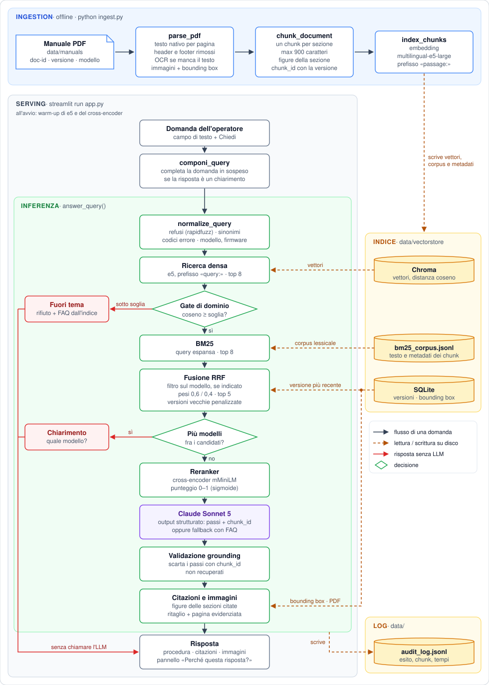

# challenge-registratori_cassa-catanzani

Challenge per la realizzazione di un sistema RAG per registratori di cassa.

Il sistema permette agli utenti di effettaure delle domande, generiche o specifiche, per ottenre supporto in merito all'utilizzo di registratori di cassa.

Il sistema include il codice per servire una pagina web, attraverso la quale l'utente interagirà con il sistema.

## Descrizione generale del sistema

Il sistema ralizzato può essere sintetizzato con il seguente schema:



#### Ingestion dei dati

- Parsing del PDF (testo ed immagini)
- Recupero pagine scansionate con sistema OCR
- Chunking del testo
- Embedding del testo
- Vector Store (Chroma DB)
- Corpus di BM25 (JSONL)
- Database SQLite ver versioni, immagini e bounding box

#### Inferenza

- Nomalizzazione della query (correzione errori - ricerca termini simili)
- Ricerca densa
- Gate di dominio (per reiezione domande off-topic)
- Ricerca semantica
- Fusione risultati retriever semantico e BM25 con tecnica RRF
- Reranker
- LLM per la generazione della risposta
- Validazione della risposta
- Recupero delle immagini (se presenti) nei chunk citati

#### Serving

- Serving pagina web tramite framework `Streamlit`

#### Logging

- Logging delle metriche di performance su disco (file JSONL)

## Setup

Creazione dell'ambiente e installazione delle dipendenze: [INSTALL.md](INSTALL.md).
In alternativa, senza installare nulla oltre a Docker: [Esecuzione con Docker](#esecuzione-con-docker).

## Configurazione

Le impostazioni si leggono da un file `.env` nella radice del repository.
`.env.example` elenca le variabili disponibili con i rispettivi default:

```bash
cp .env.example .env
```

Per l'ingestion **non serve nessuna chiave**: gli embedding sono calcolati in
locale. `ANTHROPIC_API_KEY` diventa necessaria solo per la fase di risposta,
che usa l'API Anthropic.

Ogni campo della classe `Settings` in [config.py](config.py) e' sovrascrivibile
dalla variabile d'ambiente omonima in maiuscolo — per esempio `EMBEDDING_MODEL`
o `TOP_K_FINAL`.

## Ingestion

L'ingestion trasforma un manuale PDF nell'indice interrogabile: estrae testo e
immagini pagina per pagina (con OCR di fallback sulle pagine scansionate), lo
divide in chunk e ne persiste embedding, corpus lessicale e metadati.

```bash
python ingest.py --pdf data/manuals/printf_f_manuale_v03.pdf --doc-id printf_f --version v03 --model "PRINT! F"
```

| Argomento | Ruolo |
|---|---|
| `--pdf` | percorso del manuale da indicizzare |
| `--doc-id` | identificativo stabile del documento, invariante fra le versioni |
| `--version` | versione del manuale; a parità di `doc-id` sostituisce i chunk della precedente invece di duplicarli |
| `--model` | modello di registratore di cassa a cui il manuale si riferisce |
| `--firmware` | versione firmware documentata (opzionale: questo manuale non ne dichiara una) |

`--model` e `--firmware` non sono decorativi: finiscono nei metadati di ogni
chunk e servono a distinguere manuali di apparecchi diversi in fase di
retrieval.

`--doc-id` e `--version` del comando qui sopra non sono d'esempio: sono i valori
che l'eval set in `eval/eval_set.jsonl` si aspetta di trovare nell'indice.
Indicizzare con un `--doc-id` diverso non produce nessun errore visibile, ma fa
riportare a `scripts/eval.py` uno hit@5 di 0/24 su un sistema che funziona.

Alla **prima** esecuzione viene scaricato il modello di embedding
(`intfloat/multilingual-e5-large`, circa 2 GB) nella cache di Hugging Face in
`~/.cache/huggingface`. Le esecuzioni successive girano offline.

Output atteso:

```
Completato: 73 pagine, 17 immagini. OCR attivato su 1 pagine -> Riuscito: 0 | Vuote: 1 | Fallito: 0
Chunking...
195 chunk generati.
Indicizzazione (embeddings + BM25 + metadati + bounding box immagini)...
Completato: printf_f v03 (modello PRINT! F)
```

L'indice viene scritto in `data/vectorstore/`: Chroma per i vettori, un JSONL
con il corpus dei chunk per BM25, SQLite per versioning dei manuali e bounding
box delle immagini. Per ripartire da zero e' sufficiente cancellare quella
cartella e rilanciare il comando.

## Serving del sistema tramite Streamlit

```bash
streamlit run app.py --server.fileWatcherType none
```

Il flag spegne il file watcher di Streamlit, che serve solo a ricaricare l'app
quando si modifica il codice.

Il sistema risponde **a turno singolo**: ogni domanda viene interpretata da
sola, senza storico della conversazione. La scelta e' deliberata — il prompt
resta corto e verificabile, e la risposta e' sempre riconducibile ai soli chunk
citati. Il sistema è istruito a chiedere un chiarimento quando il contesto non basta.

## Esecuzione con Docker

L'immagine contiene gia' Python, le dipendenze e Tesseract con la lingua
italiana. Serve solo il file `.env` descritto in [Configurazione](#configurazione).
Requisiti di memoria e disco, passi completi e comandi di manutenzione sono in
[INSTALL.md](INSTALL.md#5-alternativa-esecuzione-con-docker).

```bash
docker compose run --rm app python ingest.py --pdf data/manuals/printf_f_manuale_v03.pdf --doc-id printf_f --version v03 --model "PRINT! F"
```

```bash
docker compose up
```

L'app risponde su http://localhost:8501. La cartella `data/` e' montata
dall'host: un indice gia' costruito fuori da Docker viene riusato cosi' com'e',
e l'audit log resta sull'host. I modelli finiscono nel volume `hf-cache`
(2,6 GB) e si scaricano solo al primo avvio.

Nel container embedding e reranker girano su CPU: Docker su macOS non ha
accesso alla GPU del Mac (MPS), che l'ambiente locale invece usa. Misurato su un
Mac con Apple Silicon, sulle 24 domande rispondibili dell'eval set, il
retrieval passa da circa 150 ms a 0,6–1,1 s di mediana, a seconda del carico
della macchina (tre misure), con un picco di 2,4 s oltre il budget di 2 s in
una delle tre. Sulla risposta completa, che dipende soprattutto dalla chiamata
al modello, il ritardo pesa meno. L'ingestion del manuale richiede circa 2
minuti. I risultati non cambiano: stessi 5 frammenti, nello stesso ordine, su
tutte le 24 domande. Per una dimostrazione su Mac conviene quindi l'ambiente
locale.

## Approfondimenti

- [Normalizzazione della query](docs/normalizzazione-query.md) — come la domanda
  viene ripulita prima del retrieval: estrazione dei metadati, correzione dei
  refusi, espansione sinonimica, e perche' la correzione fuzzy ha bisogno di una
  guardia sulle parole funzionali.
- [La soglia del gate di dominio](docs/soglia-gate-dominio.md) — perche' il gate
  esiste, perche' i suoi due errori non costano uguale, e come si ricava il
  numero in `OFF_TOPIC_SIMILARITY_THRESHOLD`.
- [Fusione RRF e reranker](docs/rrf-e-reranker.md) — i quattro punteggi della
  pipeline, perche' serve un secondo stadio, cosa significa il punteggio del
  reranker e perche' il gruppo di candidati resta a 5.

## Strumenti di analisi

`scripts/` contiene strumenti di indagine, non codice di produzione: non
partecipano al funzionamento del sistema, ma le loro dipendenze sono incluse in
`requirements.txt` insieme a tutto il resto, cosi' l'ambiente e il punto di
installazione restano uno solo.

```bash
python scripts/compare_chunking.py --pages 30 31
```

[calibrate_threshold.py](scripts/calibrate_threshold.py) ricalcola la soglia del
gate di dominio (`OFF_TOPIC_SIMILARITY_THRESHOLD`) sui punteggi reali
dell'indice. Va rilanciato dopo ogni re-ingestione, per accorgersi se i punteggi
si sono spostati; il criterio dietro la formula e' in
[docs/soglia-gate-dominio.md](docs/soglia-gate-dominio.md).

[calibrate_fuzzy.py](scripts/calibrate_fuzzy.py) misura, al variare di
`FUZZY_THRESHOLD`, quanti refusi sintetici vengono ricondotti al termine di
dominio giusto e quanto testo corretto del manuale viene riscritto, con e senza
la guardia sulle parole funzionali. Risultati e motivazione della soglia sono in
[docs/normalizzazione-query.md](docs/normalizzazione-query.md).

[compare_chunking.py](scripts/compare_chunking.py) mette a confronto, sulle
stesse pagine e con lo stesso modello di embedding, il chunking strutturato
adottato dal progetto e il `SemanticChunker` di LangChain, riportando per
entrambi numero di chunk, lunghezze e quota di blocchi con un titolo di
sezione riconosciuto.
