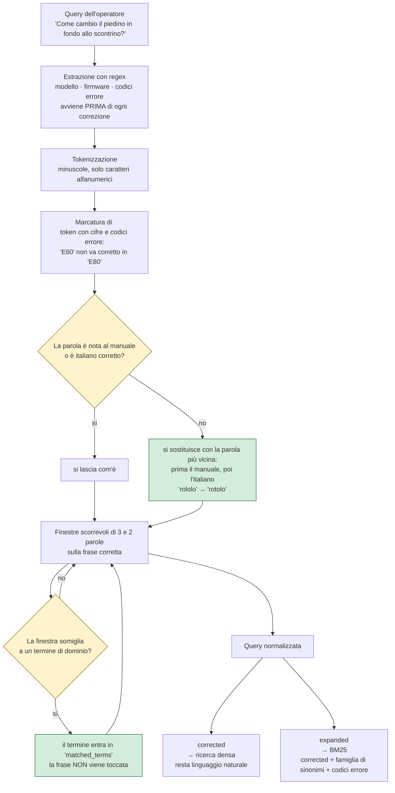
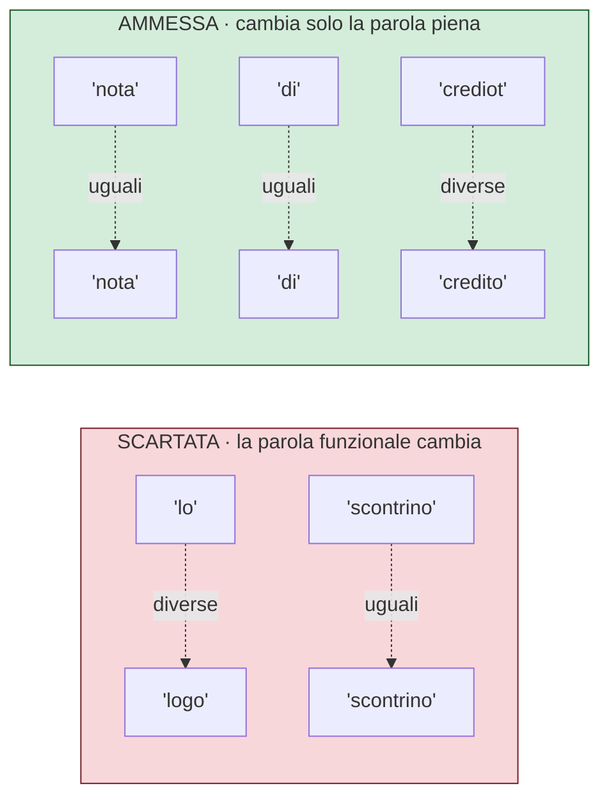

# Normalizzazione della query

La domanda dell'operatore non arriva al retrieval così com'è; questa prima passa da
[`src/retrieval/query_processing.py`](../src/retrieval/query_processing.py). Questo software si occupa di:

- estrarre i metadati (modello, firmware, codici errore)
- correggere i refusi
- costruire due forme distinte della query: una per la ricerca densa e una,
espansa con i sinonimi di dominio, per BM25.

La parte più delicata è la correzione dei refusi, ed è divisa in due stadi con
rischi molto diversi:

1. **la correzione vera e propria**, parola per parola, che riscrive la domanda
   dell'operatore. Se sbaglia, la ricerca parte da una frase che l'operatore non
   ha mai scritto;
2. **il riconoscimento dei termini di dominio**, a meno di refusi, che serve solo
   ad aggiungere i sinonimi alla query di BM25. Se sbaglia, BM25 riceve qualche
   sinonimo di troppo.

Questo documento descrive i due stadi, i vocabolari che usano e le misure con cui
sono stati tarati.

## Il flusso completo



## La correzione dei refusi

La correzione lavora su una parola alla volta e si regge su tre vocabolari con
ruoli distinti:

| la parola scritta dall'operatore | cosa succede | perché |
|---|---|---|
| è fra le 1811 parole del manuale indicizzato (`rotolo`, `dgfe`, `di`) | resta com'è | è già un bersaglio buono per il retrieval |
| non è nel manuale ma è italiano corretto (`cassetto`, `carbonara`) | resta com'è | correggerla cambierebbe la domanda |
| non è né l'uno né l'altro (`rololo`, `strono`) | diventa la parola più vicina, cercata prima nel manuale e poi in italiano | è un refuso |

**Il bersaglio è il manuale, non la lingua.** Le parole candidate si leggono
dall'indice (`bm25_corpus.jsonl`), quindi il vocabolario si aggiorna a ogni
ingestion e contiene il gergo: `dgfe` compare 48 volte ed è quindi intoccabile.
Un correttore ortografico generico, che sceglie in base alla frequenza della
lingua, qui farebbe danni: misurato, trasforma `dgfe` in `due`, `registratore`
in `registrato` e `strono` in `strano` invece che in `storno`.

**L'italiano fa da freno e da riserva.** Il vocabolario viene da `wordfreq`, che
per ogni parola dà anche quanto è comune nella lingua (scala zipf). Il freno è la
garanzia di non riscrivere italiano corretto: senza, su una domanda fuori tema
`carbonara` diventerebbe `carbonato`. Da riserva interviene in due casi:

- quando offre una parola **strettamente più vicina** di quella del manuale:
  `impotso` diventa `imposto` (distanza 1) e non `importo` (distanza 2), che
  nella domanda vorrebbe dire un'altra cosa;
- quando il manuale **non ha candidati**: `prenoatzione` diventa `prenotazione`.
  Non aiuta il retrieval, perché quella parola nei chunk non c'è, ma l'operatore
  vede la propria domanda scritta bene invece che storpiata.

Le regole di dettaglio, in `_correggi_parola()`:

- si correggono solo parole di almeno **5 lettere**: sotto, una lettera cambia
  troppo il significato;
- i token con cifre restano intoccabili, come i codici errore (`E60`);
- la distanza è quella di **Damerau**, che conta lo scambio di due lettere
  adiacenti come un errore solo: è il refuso di battitura più comune
  (`strono` → `storno`);
- si accetta **un errore** fino a 6 lettere, **due** oltre;
- fra le parole del manuale alla stessa distanza vince la più frequente nel
  manuale; fra quelle italiane, la più frequente nella lingua;
- a parità di distanza fra manuale e italiano vince il manuale, altrimenti
  `strono` diventerebbe `stronco` invece di `storno`.

### La soglia sulla frequenza italiana

`SOGLIA_ZIPF` decide quanto una parola deve essere comune per contare come
italiana, e quindi essere protetta e utilizzabile come candidato. Il valore viene
da una misura su 400 refusi sintetici, che vanno corretti, e sulle 48 parole
corrette che compaiono nelle domande reali senza essere nel manuale, che non
vanno toccate:

| soglia zipf | refusi corretti bene | parole corrette riscritte |
|---|---|---|
| **1,0** | **362/400 (90%)** | **0/48** |
| 1,5 | 371/400 (93%) | 2 (`configuro` → `configura`, `abilito` → `abilita`) |
| 2,0 | 373/400 (93%) | 3 (in più `emetto` → `emette`) |
| 3,0 | 377/400 (94%) | 9 (fra cui `collego` → `colleg`) |

Alzando la soglia si recuperano pochi refusi in più, perché quelli che restano
sono parole che esistono davvero nei testi da cui `wordfreq` ricava le frequenze,
e in cambio si riscrive italiano legittimo ma poco frequente. Sopra 3,0 compaiono
correzioni verso parole spazzatura. A 1,0 nessuna parola corretta viene toccata.

### Un esempio con tre refusi

```
normalize_query('come sostituisco il rololo di crata nella stampnate')

corrected     = 'come sostituisco il rotolo di carta nella stampante'
corrections   = [('rololo', 'rotolo'), ('crata', 'carta'), ('stampnate', 'stampante')]
matched_terms = ['rotolo']
```

Ogni parola è valutata da sola, quindi le preposizioni in mezzo non disturbano:
`rololo di crata` viene corretto anche se il manuale scrive `rotolo carta`.
Rispetto alla stessa domanda scritta bene, questa frase recupera gli stessi 5
frammenti; con il correttore precedente, che confrontava espressioni intere, ne
recuperava 2 su 5.

### I limiti misurati

- **Refusi su parole corte non vengono corretti:** `dtaa` per `data`, `mnc` per
  `mmc`, `dgef` per `dgfe` restano tali, perché sotto le 5 lettere il rischio di
  rovinare una parola giusta supera il beneficio.
- **Quando la parola giusta non è nel manuale si perde l'aggancio lessicale:**
  `sosittuisco` diventa `sostituisco`, che è la parola intesa ma nel manuale non
  compare, invece di `sostituisce`, che compare. BM25 perde un termine, la
  ricerca densa no: nelle misure la differenza non si vede.
- **Il vocabolario italiano ha ancora qualche buco:** `azzero` non compare in
  `wordfreq` e quindi non è protetto, e diventa `azzera`, che nel manuale c'è. È
  un cambio di persona, non di significato, e resta visibile all'operatore nella
  riga «Ho interpretato la domanda correggendo…».
- **Il costo in tempo si sente solo sulle domande con refusi:** i candidati si
  cercano fra 283.640 parole italiane invece che fra le 1811 del manuale, quindi
  la normalizzazione passa da 1,6 ms a circa 60 ms di mediana. Sulle domande
  scritte bene resta 0,1 ms, perché nessuna parola va cercata. Il vocabolario si
  costruisce una volta sola all'avvio, in 1,6 s, assorbiti dal warm-up dell'app.

## Il riconoscimento dei termini di dominio

Il secondo stadio, `_termini_riconosciuti()`, scorre la frase **già corretta** a
finestre di tre parole e poi di due. Per ogni finestra si pone una domanda sola:
*queste due o tre parole, prese insieme, sono un termine di dominio scritto con
qualche refuso?*

A rispondere è `_best_vocab_match()`, nello stesso file. Confronta la finestra
**per intero** con i termini del vocabolario che hanno lo stesso numero di
parole, e restituisce il più somigliante se supera la soglia, altrimenti `None`.
Non cerca un termine *dentro* la finestra: mette a confronto due stringhe
intere.

La differenza rispetto al primo stadio è che qui **la frase non viene toccata**:
il termine riconosciuto finisce solo in `matched_terms`, da cui nasce
l'espansione sinonimica per BM25. Così `carta esaurito` viene riconosciuto come
il termine `carta esaurita` e porta con sé i suoi sinonimi, ma la domanda
dell'operatore resta quella che ha scritto.

Il vocabolario non è un dizionario della lingua italiana: sono i 118 termini che
il dominio usa davvero (`annullo scontrino`, `nota di credito`, `chiusura
giornaliera`), ricavati dalle 18 famiglie di sinonimi dichiarate in cima al file.

## Un esempio completo, dai token alla query espansa

La domanda «Come faccio uno strono scontrino?», con `strono` al posto di
`storno`. Questi sono i passi, eseguendo `normalize_query()`.

**1. Estrazione con regex**: nessun modello, nessun firmware, nessun codice errore.

**2. Tokenizzazione**: `['come', 'faccio', 'uno', 'strono', 'scontrino']`, nessun
token protetto perché non ci sono cifre.

**3. Correzione parola per parola**: `strono` non è nel manuale e non è italiano,
quindi si cerca la parola del manuale più vicina. `storno` è a distanza 1, uno
scambio di due lettere, e compare 35 volte.

```
corrections = [('strono', 'storno')]
corrected   = 'come faccio uno storno scontrino'
```

**4. Riconoscimento dei termini** sulla frase già corretta, a finestre di tre e
poi di due parole:

| finestra | termine più somigliante | `fuzz.ratio` | esito |
|---|---|---|---|
| come faccio uno | forme di pagamento | 48,5 | scartata |
| faccio uno storno | ragione sociale scontrino | 52,4 | scartata |
| uno storno scontrino | ragione sociale scontrino | 62,2 | scartata |
| come faccio | codice iva | 47,6 | scartata |
| faccio uno | fine turno | 60,0 | scartata |
| uno storno | inizio turno | 63,6 | scartata |
| **storno scontrino** | **storno scontrino** | **100,0** | **riconosciuto** |

**5. Risultato**:

```
matched_terms = ['storno', 'storno scontrino']
expanded      = 'come faccio uno storno scontrino | storno | annullo | annulla | storni e annulli |
                 cancellazione articolo | storna | storno scontrino | annullo scontrino |
                 annulla scontrino | cancellazione scontrino | annullamento scontrino |
                 cancellare lo scontrino'
```

`corrected` va alla ricerca densa e resta una frase in italiano. `expanded`, con
tutte le famiglie sinonimiche dei termini riconosciuti, va a BM25. La coppia in
`corrections` è quella che l'app mostra all'operatore.

### Perché il riconoscimento lavora sulle espressioni e la correzione sulle parole

Sono due mestieri diversi. La correzione deve intervenire su una parola singola,
perché è lì che casca il refuso, e per farlo in sicurezza si appoggia ai due
dizionari: se la parola è nota, non si tocca. Il riconoscimento invece deve
capire di quale procedura si sta parlando, e per farlo serve il contesto: `fine`
da sola non dice niente, `fine carta` sì.

Questa divisione ha una conseguenza pratica visibile. Il riconoscimento confronta
le finestre per intero con i termini che hanno lo stesso numero di parole, quindi
`storno dello scontrino` non viene ricondotto a `storno scontrino`: la
preposizione in mezzo lo rende una finestra di tre parole, e il termine ne ha
due. Non è un problema come lo era prima, perché nel frattempo la frase è già
stata corretta parola per parola: si perdono solo i sinonimi aggiuntivi per
BM25, non la correzione.

## Il controllo sulle parole funzionali

Serve al secondo stadio, il riconoscimento: impedisce che una finestra venga
ricondotta a un termine promuovendo una parola funzionale a parola piena
(`lo scontrino` → `logo scontrino`, `allo scontrino` → `annullo scontrino`).

Il confronto è **posizionale**, non "la finestra contiene una parola
funzionale". La differenza non è cosmetica: 14 termini del vocabolario
contengono un articolo o una preposizione — `nota di credito`, `data e ora`,
`chiusura di cassa`, `cancellare lo scontrino` — e devono restare riconoscibili.



La regola è: **rifiuta se esiste una posizione in cui i due token differiscono
e quello scritto dall'utente è una parola funzionale.** Si guarda ciò che
l'utente ha scritto, non ciò che il sistema vorrebbe metterci: se ha scritto
`lo`, nessun punteggio di similarità è una buona ragione per decidere che
intendesse `logo`.

